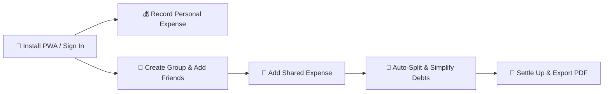

<div align="center">

  <h1>💰 Oweo</h1>
  <p><strong>Personal Expense Tracker + Shared Expense Splitter PWA</strong></p>
  <p><em>A modern, mobile-first Progressive Web App designed for Indian students, roommates, hostel friends, and young professionals.</em></p>

  <p>
    <a href="#-how-to-use-guide"></a>
    <a href="#-how-it-works-guide"></a>
    <a href="#-features"></a>
  </p>

  <p>
    
    
    
    
    
    
    
    
  </p>

</div>

---

> [!TIP]
> **Oweo answers two everyday financial questions in seconds:**
> 1. 🔍 **“Where did my money go?”** — Effortless personal expense recording, smart heuristic parsing, visual analytics, and simple monthly budgeting.
> 2. 🤝 **“Who owes whom?”** — Frictionless shared bill splitting, greedy debt simplification, and clear balance tracking.

---

## 📑 Table of Contents

- [✨ Features](#-features)
  - [💰 Personal Expense Tracking](#-personal-expense-tracking)
  - [🤝 Shared Expense Splitting](#-shared-expense-splitting)
  - [💸 Debt & Settlement Tracking](#-debt--settlement-tracking)
  - [📊 Spending Insights & Visuals](#-spending-insights--visuals)
  - [🎯 Budgeting & Daily Allowance](#-budgeting--daily-allowance)
  - [📄 Financial PDF & CSV Export](#-financial-pdf--csv-export)
  - [🎨 Customization & Theme Engine](#-customization--theme-engine)
  - [📶 Offline-First PWA](#-offline-first-pwa)
  - [🔐 Auth & Cloud Sync](#-auth--cloud-sync)
- [📖 How to Use Guide](#-how-to-use-guide)
  - [Step 1: Installing the PWA](#step-1-installing-the-pwa)
  - [Step 2: Logging Personal Expenses](#step-2-logging-personal-expenses)
  - [Step 3: Creating Groups & Splitting Bills](#step-3-creating-groups--splitting-bills)
  - [Step 4: Settling Up Debts](#step-4-settling-up-debts)
  - [Step 5: Budgeting & PDF Export](#step-5-budgeting--pdf-export)
- [⚙️ How It Works Guide](#-how-it-works-guide)
  - [🧮 Integer Paise Arithmetic](#-integer-paise-arithmetic)
  - [🔀 Greedy Debt Simplification Algorithm](#-greedy-debt-simplification-algorithm)
  - [💾 Multi-Tab Offline Firestore Sync](#-multi-tab-offline-firestore-sync)
  - [🛡️ Security & Privacy Architecture](#-security--privacy-architecture)
- [🏗️ Tech Stack & Architecture](#️-tech-stack--architecture)
- [📂 Project Structure](#-project-structure)
- [🗄️ Firestore Data Model](#️-firestore-data-model)
- [🚀 Quick Start & Installation](#-quick-start--installation)
- [🚫 Non-Goals](#-non-goals)
- [🗺️ Future Roadmap](#️-future-roadmap)
- [📌 Repository Info](#-repository-info)

---

## ✨ Features

<div align="center">

| Feature Area | Key Highlights | Target Experience |
| :--- | :--- | :--- |
| 💰 **Personal Tracking** | Quick-text NLP parser, 1-tap category chips, INR formatting | Record in < 5 seconds |
| 🤝 **Shared Splitting** | Equal, Custom, and Percentage split engines | Zero decimal drift |
| 💸 **Debt Simplification** | Circular debt reduction graph ($A \to B \to C \Rightarrow A \to C$) | Minimal transfer count |
| 📊 **Visual Analytics** | Donut charts, Bar charts, MoM comparisons | Clean financial clarity |
| 🎯 **Monthly Budgeting** | Spent vs remaining progress bar, Daily allowance indicator | Daily spending check |
| 📄 **Data Export** | Client-side PDF statement generation + CSV ledger export | Portable reports |
| 🎨 **Theme Engine** | Dark/Light/System + 6 color accents + Hex picker | Personalized look |
| 📶 **Offline PWA** | Multi-tab IndexedDB cache, Web App Manifest | Native app feel |

</div>

### 💰 Personal Expense Tracking
- **Lightning-Fast Entry**: Keypad-first numeric input (`inputMode="decimal"`) designed for quick mobile tap-in.
- **Smart NLP Heuristic Parser**: Instantly auto-fills description, amount, and category from raw text inputs (e.g. typing `"180 dinner"` auto-sets `Amount: ₹180`, `Category: Food`, `Description: Dinner`).
- **Comprehensive Categorization**: Pre-built color-coded categories (Food, Travel, Groceries, Rent, Shopping, Entertainment, Subscriptions, Bills, Health, Personal Care, Education, Gifts, Other).
- **Payment Method Tags**: Tag transactions with UPI, Card, Cash, or Net Banking for detailed spending context.
- **India-First Localization**: Native INR formatting with ₹ symbol and Indian numbering system (e.g. `₹1,25,000.00`).

### 🤝 Shared Expense Splitting
- **Versatile Group Management**: Create dedicated spaces for Roommates, Hostel Flatmates, Goa Trips, Project Teams, or Event groups.
- **Flexible Split Engines**:
  1. **Equal Split**: Automatically divides bills equally while preserving 1-paise residue to eliminate lost decimal rounding errors.
  2. **Custom Amount Split**: Real-time sum validation with interactive discrepancy alerts.
  3. **Percentage Split**: Proportional allocation with strict 100.0% validation checks.
- **Custom Participant Selection**: Easily include or exclude specific group members per expense.

### 💸 Debt & Settlement Tracking
- **Greedy Graph Minimization**: Automatically converts complex net balances across groups into the minimum possible direct repayment paths.
- **Live Net Balances**: Instant dashboard view of *"Who owes you"* (Green) and *"Who you owe"* (Orange).
- **1-Tap Settle Up**: Record manual settlements effortlessly without purging past expense history, preserving full auditability.

### 📊 Spending Insights & Visuals
- **Interactive Recharts**:
  - 🍩 **Category Breakdown**: Visual donut chart highlighting top spending categories.
  - 📊 **Spending Volume**: Weekly and monthly bar charts showing spending velocity over time.
  - 📈 **Month-over-Month**: Comparative cards showing percentage changes vs prior months.
- **Smart Non-Judgmental Insights**: Automated observations highlighting daily average spending, top category ratios, and budget velocity.

### 🎯 Budgeting & Daily Allowance
- **Simple Monthly Budgeting**: Set a target monthly limit and monitor real-time progress.
- **Dynamic Daily Allowance**: Calculates how much you can spend per remaining day of the month ($₹\text{Remaining} / \text{Days Left}$) to stay strictly on target.

### 📄 Financial PDF & CSV Export
- **Client-Side PDF Generator**: Generates professional PDF bank-style financial statements directly in the browser via `jspdf` + `jspdf-autotable`. Includes KPI summary cards, category allocation table, QR code verification, and itemized transaction log.
- **CSV Data Export**: One-click raw CSV export for Excel, Google Sheets, or custom data analysis.

### 🎨 Customization & Theme Engine
- **Visual Themes**: Light mode, Dark mode, and automatic System preference sync.
- **Vibrant Accent Palettes**: Choose from 6 curated preset themes (*Teal, Emerald, Indigo, Violet, Rose, Amber*) or enter a **Custom Hex Code Color**.
- **WCAG Compliant Tokens**: Dynamic CSS variable system ensuring high contrast and high legibility across all custom colors.

### 📶 Offline-First PWA
- **Installable Native Experience**: Add to Home Screen on iOS, Android, macOS, and Windows.
- **Offline Firestore Persistence**: Uses Firestore's `persistentLocalCache` and `persistentMultipleTabManager` to store transactions in IndexedDB. Add personal expenses offline; changes automatically sync when back online.
- **Service Worker Caching**: Instant sub-second loading powered by `vite-plugin-pwa`.

### 🔐 Auth & Cloud Sync
- **Seamless Google Sign-In**: Frictionless authentication powered by Firebase Auth.
- **Multi-Device Synchronization**: Add an expense on your mobile phone, immediately view it on your laptop.

---

## 📖 How to Use Guide



### Step 1: Installing the PWA
- **On Mobile (iOS/Android)**:
  1. Open Oweo in Safari (iOS) or Chrome (Android).
  2. Tap the **Share** button (iOS) or the **⋮ Menu** (Android).
  3. Select **Add to Home Screen** 📲.
- **On Desktop (Chrome/Edge)**:
  1. Click the **Install Icon** in the browser address bar.
  2. Launch Oweo as a standalone desktop app!

### Step 2: Logging Personal Expenses
1. Tap the **+ Add Expense** button at the bottom center.
2. Type an expense line using the **Smart NLP Input**:
   - Example: Type `"250 Swiggy"` → Oweo parses `₹250.00`, selects `Food`, and titles it `"Swiggy"`.
3. Or manually enter the amount using the large numeric keypad.
4. Select the category chip and payment method (UPI, Cash, Card).
5. Tap **Save Expense**. Done! ⚡

### Step 3: Creating Groups & Splitting Bills
1. Navigate to the **Groups** tab and tap **+ New Group**.
2. Name your group (e.g. `"Goa Vacation 🌴"`, `"Flat 302 🏠"`).
3. Share the generated **Invite Link / Code** with your friends.
4. When adding a group expense:
   - Select who paid the bill.
   - Choose the **Split Mode**:
     - ⚖️ **Equal**: Evenly splits the bill among all checked participants.
     - 🔢 **Custom**: Type exact individual amounts. Oweo validates total sum matching in real-time.
     - 📊 **Percentage**: Assign percentages to participants until the total reaches 100%.

### Step 4: Settling Up Debts
1. Go to the **Group Dashboard** or main **Debts** card.
2. Check your net standing:
   - 🟢 **Green Card**: Shows members who owe you money.
   - 🟠 **Orange Card**: Shows members you owe money to.
3. Tap **Settle Up** next to a friend's name.
4. Confirm the settled amount (UPI or cash payment). Oweo creates a settlement record while maintaining the original expense history for full transparency!

### Step 5: Budgeting & PDF Export
1. Go to **Profile → Budget Settings**.
2. Set your monthly spending budget (e.g. `₹15,000`).
3. Check your **Daily Allowance Widget** on the home screen to know your remaining daily safe spend.
4. Go to **Profile → Export Data** to download your monthly **PDF Financial Report** or **CSV Ledger**.

---

## ⚙️ How It Works Guide

### 🧮 Integer Paise Arithmetic
Floating-point binary arithmetic in JavaScript (e.g. `0.1 + 0.2 = 0.30000000000000004`) can lead to terrible rounding errors in financial apps.

Oweo completely solves this by executing **100% of financial business logic in integer minor units (Paise)**:

$$\text{Amount in Paise} = \text{Math.round}(\text{Rupee Amount} \times 100)$$

- `₹180.50` is stored and calculated as `18050` paise.
- When performing equal splits across $N$ participants:
  $$\text{Base Share} = \lfloor \frac{\text{Total Paise}}{N} \rfloor$$
  $$\text{Residue Paise} = \text{Total Paise} - (\text{Base Share} \times N)$$
- The 1-paise residue is deterministically distributed to the first $R$ participants, guaranteeing:
  $$\sum \text{Participant Shares} \equiv \text{Total Expense Amount}$$

> [!IMPORTANT]
> Zero floating-point rounding errors. Zero lost paise. Complete precision across all split types.

---

### 🔀 Greedy Debt Simplification Algorithm
In a shared group, multiple cross-transactions create tangled webs of debt (e.g., Alice owes Bob ₹500, Bob owes Charlie ₹500, Charlie owes Alice ₹200).

Oweo implements a **Greedy Net-Balance Debt Minimization Algorithm**:

```
      Tangled Debts (3 Transfers)               Simplified Debts (1 Transfer)
  ┌───────┐     ₹500     ┌───────┐                  ┌───────┐
  │ Alice │ ───────────► │  Bob  │                  │ Alice │
  └───────┘              └───────┘                  └───────┘
      ▲                      │                          │
      │ ₹200                 │ ₹500                     │ ₹300
      │                      ▼                          ▼
  ┌──────────────────────────────┐                  ┌───────┐
  │           Charlie            │                  │Charlie│
  └──────────────────────────────┘                  └───────┘
```

#### Algorithm Steps:
1. **Compute Net Balances**: For every user $i$ in group $G$, sum up all payments made vs. shares owed:
   $$\text{NetBalance}[i] = \sum \text{Paid}[i] - \sum \text{Owed}[i]$$
2. **Partition Users**: Separate members into **Debtors** ($\text{NetBalance} < 0$) and **Creditors** ($\text{NetBalance} > 0$).
3. **Greedy Match**:
   - Pick the maximum debtor $D$ (most negative balance) and maximum creditor $C$ (most positive balance).
   - Calculate transfer amount: $M = \min(| balance[D] |, | balance[C] |)$.
   - Record simplified transaction: $D \text{ pays } C \text{ amount } M$.
   - Update balances for $D$ and $C$.
   - Repeat until all net balances reach $0$.

This reduces $O(V^2)$ circular debts down to at most $V-1$ minimal payments!

---

### 💾 Multi-Tab Offline Firestore Sync
Oweo is built around an **Offline-First Data Pipeline**:

```
 [ UI View Component ]
         │
         ▼
 [ Zustand State Store ]
         │
         ▼
 [ Firestore Web SDK ] ──► (IndexedDB Local Cache) ──► Instant UI Render
         │
         ▼ (When Online)
 [ Cloud Firestore DB ]
```

1. **Immediate Local Reads**: When the app opens, data is rendered instantly from IndexedDB via `persistentLocalCache`.
2. **Optimistic Writes**: New expenses are written to IndexedDB immediately, rendering on screen in $< 10\text{ms}$.
3. **Background Network Queue**: When offline, write mutations are queued locally. Once connection is restored, Firebase background listeners sync pending mutations to Cloud Firestore automatically.
4. **Multi-Tab Coordination**: `persistentMultipleTabManager` synchronizes tab states via Web Locks API without conflicts.

---

### 🛡️ Security & Privacy Architecture
Oweo prioritizes financial data privacy and authorization enforcement:

- **Database-Level Authorization**: Security is enforced using strict **Cloud Firestore Security Rules** (`firestore.rules`), independent of frontend checks.
- **Personal Expense Isolation**: Personal expense documents are readable and writeable *only* by the authenticated document owner (`request.auth.uid == userId`).
- **Group Scope Validation**: Group expenses and member lists are accessible *only* to verified group members (`request.auth.uid in resource.data.memberIds`).
- **Zero Banking Data**: Oweo does not store bank account numbers, passwords, UPI PINs, or process monetary transactions. It strictly handles organizational ledger balances.

---

## 🏗️ Tech Stack & Architecture

```
                                    ┌─────────────────────────────────────────┐
                                    │                Oweo PWA                 │
                                    └────────────────────┬────────────────────┘
                                                         │
         ┌───────────────────────────────────────────────┼───────────────────────────────────────────────┐
         ▼                                               ▼                                               ▼
┌───────────────────┐                           ┌───────────────────┐                           ┌───────────────────┐
│   Presentation    │                           │   Domain Core     │                           │ Services & Data   │
├───────────────────┤                           ├───────────────────┤                           ├───────────────────┤
│ • React 18        │                           │ • Money / Paise   │                           │ • Firebase Auth   │
│ • TypeScript      │ ── Uses Domain Logic ──►  │ • Split Engine    │ ── Persists Data via ──► │ • Cloud Firestore │
│ • Tailwind CSS    │                           │ • Debt Minimizer  │                           │ • IndexedDB Cache │
│ • Recharts        │                           │ • Analytics Core  │                           │ • jsPDF Generator │
└───────────────────┘                           └───────────────────┘                           └───────────────────┘
```

- **Frontend**: React 18, TypeScript (Strict Mode), Vite 6, Tailwind CSS v3.4, Lucide Icons, Framer Motion
- **State Management**: Zustand v5 + Firebase Realtime `onSnapshot` listeners
- **Database & Auth**: Firebase Web SDK v11 (Google Auth + Cloud Firestore)
- **Visual Analytics**: Recharts
- **PDF & QR Engine**: `jspdf`, `jspdf-autotable`, `qrcode`
- **Testing**: Vitest, React Testing Library, JSDOM

---

## 📂 Project Structure

```
Oweo/
├── src/
│   ├── app/
│   │   ├── App.tsx             # Main Application root component
│   │   ├── routes.tsx          # React Router tree definition
│   │   └── providers.tsx       # Toast, Theme, & Auth providers
│   ├── components/
│   │   ├── ui/                 # Atomic UI primitives (Button, Input, Sheet, Card, Dialog, Toast)
│   │   ├── layout/             # AppShell, Sidebar, BottomNav, TopHeader, OfflineBadge
│   │   └── feedback/           # ErrorBoundary, LoadingScreen, FirebaseSetupGuide
│   ├── domain/
│   │   ├── money/              # Integer paise math & Indian currency formatter
│   │   ├── expenses/           # Category definitions & Heuristic NLP parser
│   │   ├── splits/             # Equal, Custom, and Percentage split engines
│   │   ├── settlements/        # Greedy debt simplification & balance derivation
│   │   └── analytics/          # Monthly metrics & deterministic insights engine
│   ├── features/
│   │   ├── auth/               # Google Auth & LoginView
│   │   ├── dashboard/          # Spending summary, Quick actions, Debt overview cards
│   │   ├── expenses/           # AddExpenseSheet, EditExpenseModal, ExpenseListItem
│   │   ├── groups/             # GroupCard, GroupDetailView, AddGroupExpenseModal, Invites
│   │   ├── settlements/        # SettleUpModal & history
│   │   ├── insights/           # CategoryDonutChart, SpendingBarChart, MoM Comparison
│   │   └── profile/            # ThemeSettings, BudgetSettings, ExportSection
│   ├── services/
│   │   ├── firebase/           # Firebase init, Auth, Expense & Group services
│   │   └── export/             # csvExporter & pdfReportGenerator engines
│   ├── stores/                 # Zustand state stores (Auth, Expense, Group, Theme)
│   ├── styles/                 # Tailwind globals & dynamic Theme Design Tokens
│   └── test/                   # Vitest unit & component test suites
├── firestore.rules             # Production Security Rules
├── firestore.indexes.json      # Firestore Composite Index definitions
├── vite.config.ts              # Vite + PWA Manifest configuration
└── package.json
```

---

## 🗄️ Firestore Data Model

```
users/{userId}
  ├── uid: string
  ├── displayName: string
  ├── email: string
  ├── monthlyBudgetPaise: number
  └── themePreference: string

expenses/{expenseId}
  ├── userId: string
  ├── amountPaise: number
  ├── category: string
  ├── title: string
  ├── date: string
  └── paymentMethod: 'UPI' | 'Card' | 'Cash' | 'NetBanking'

groups/{groupId}
  ├── name: string
  ├── description: string
  ├── createdBy: string
  ├── memberIds: string[]
  │
  ├── members/{userId}
  │     └── role: 'owner' | 'member'
  │
  ├── expenses/{expenseId}
  │     ├── amountPaise: number
  │     ├── payerId: string
  │     ├── splitType: 'EQUAL' | 'CUSTOM' | 'PERCENTAGE'
  │     └── participants: Map<userId, ParticipantShare>
  │
  └── settlements/{settlementId}
        ├── payerId: string
        ├── receiverId: string
        └── amountPaise: number
```

---

## 🚀 Quick Start & Installation

### Prerequisites
- **Node.js**: `v18.0.0` or higher
- **npm**: `v9.0.0` or higher

### 1. Clone the Repository
```bash
git clone https://github.com/your-username/Oweo.git
cd Oweo
```

### 2. Install Dependencies
```bash
npm install
```

### 3. Setup Firebase Environment Variables
Copy `.env.example` to `.env` and fill in your Firebase configuration:
```bash
cp .env.example .env
```

Set the values in `.env`:
```env
VITE_FIREBASE_API_KEY=your_api_key
VITE_FIREBASE_AUTH_DOMAIN=your_project_id.firebaseapp.com
VITE_FIREBASE_PROJECT_ID=your_project_id
VITE_FIREBASE_STORAGE_BUCKET=your_project_id.appspot.com
VITE_FIREBASE_MESSAGING_SENDER_ID=your_sender_id
VITE_FIREBASE_APP_ID=your_app_id
```

### 4. Development Commands

| Command | Action |
| :--- | :--- |
| `npm run dev` | Starts the Vite local development server |
| `npm run test` | Executes the Vitest unit test suite |
| `npm run lint` | Performs TypeScript strict type checking |
| `npm run build` | Compiles the production bundle & PWA service worker |
| `npm run preview` | Previews the compiled production build locally |

---

## 🚫 Non-Goals

To maintain high performance, speed, and simplicity, Oweo is **intentionally NOT**:
- ❌ A banking application or UPI payment gateway.
- ❌ An investment tracker or crypto wallet.
- ❌ A loan management or credit scoring tool.
- ❌ A financial advice service or accounting suite replacement.

*Oweo is 100% focused on fast personal tracking, clear bill splitting, and debt clarity.*

---

## 🗺️ Future Roadmap

- 🌐 **Multi-Currency Support**: Convert & split expenses across global currencies.
- 🔄 **Smart Recurring Expenses**: Automate monthly rent, WiFi bills, and subscriptions.
- 🧾 **OCR Receipt Scanning**: Scan paper bills to automatically populate group split line items.
- 📊 **Advanced Category Budgets**: Set specific monthly caps for Food, Travel, or Entertainment.
- 📤 **Additional Export Formats**: Direct JSON backup & restore workflows.

---

## 📌 Repository Info

**Suggested Repository Tagline:**
> *A modern PWA for simple expense tracking, bill splitting, budgeting, and shared-money management.*

**Suggested Repository Topics:**
`react` `typescript` `vite` `pwa` `firebase` `firestore` `expense-tracker` `expense-splitting` `personal-finance` `budgeting` `progressive-web-app` `fintech` `student-app` `tailwindcss`

---

<div align="center">
  <sub>Built with ❤️ for students, roommates, and travelers everywhere. Powered by React, Vite & Firebase.</sub>
</div>
