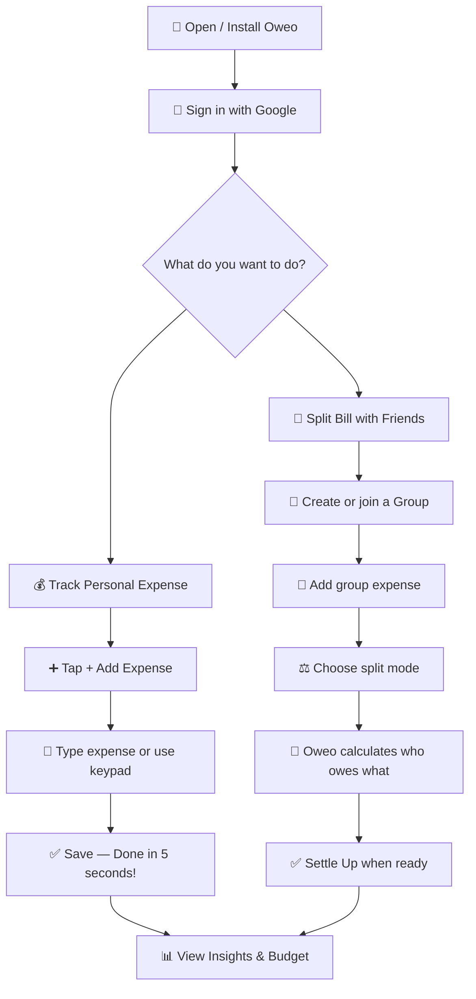
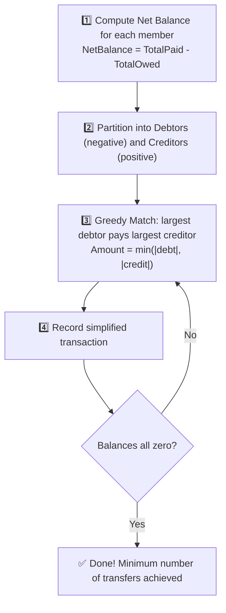
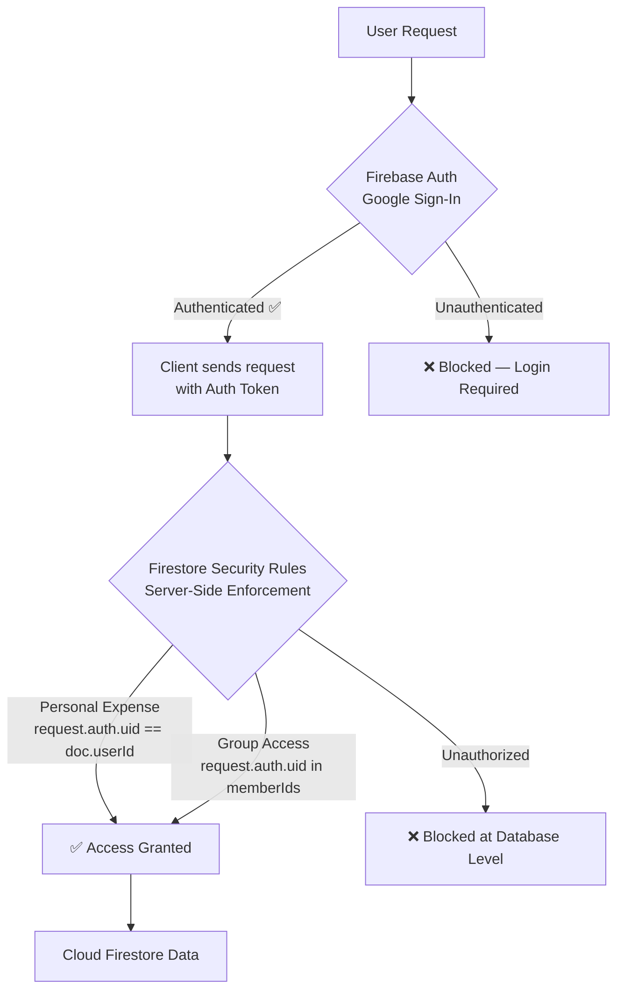

<div align="center">


<br/>

<p>
  <a href="YOUR_LIVE_DEMO_URL_HERE">
    
  </a>
  &nbsp;
  <a href="#-install-oweo-on-your-device">
    
  </a>
  &nbsp;
  <a href="#-features">
    
  </a>
</p>

<p>
  
  
  
  
  
  
  
  
  
</p>

<p>
  
  
  
</p>

<br/>

<table>
<tr>
<td align="center" width="50%">
<h3>🔍 Where did my money go?</h3>
<p>Effortless personal expense recording, smart heuristic text parsing, beautiful visual analytics, and simple monthly budgeting. Know your habits in seconds.</p>
</td>
<td align="center" width="50%">
<h3>🤝 Who owes whom?</h3>
<p>Frictionless shared bill splitting across groups, greedy circular-debt minimization, and crystal-clear balance tracking. Settle with zero confusion.</p>
</td>
</tr>
</table>

</div>

---

## 📑 Table of Contents

<details open>
<summary><strong>Click to expand / collapse navigation</strong></summary>
<br/>

| Section | Description |
| :--- | :--- |
| [📊 Key Stats at a Glance](#-key-stats-at-a-glance) | Build status, test, PWA score |
| [✨ Features](#-features) | Full breakdown of every capability |
| [📲 Install Oweo on Your Device](#-install-oweo-on-your-device) | All platforms: mobile, tablet, desktop |
| [📖 How to Use Guide](#-how-to-use-guide) | Step-by-step user guide |
| [⚙️ How It Works](#️-how-it-works) | Architecture, algorithms, data pipeline |
| [🏗️ Tech Stack](#️-tech-stack) | Libraries and tools used |
| [📂 Project Structure](#-project-structure) | Codebase layout |
| [🗄️ Firestore Data Model](#️-firestore-data-model) | Database schema |
| [🚀 Developer Quick Start](#-developer-quick-start) | Clone, configure, and run locally |
| [❓ FAQ](#-faq) | Common questions answered |
| [🚫 Non-Goals](#-non-goals) | What Oweo is not |
| [🗺️ Future Roadmap](#️-future-roadmap) | Upcoming features |

</details>

---

## 📊 Key Stats at a Glance

<div align="center">

| Metric | Status |
| :--- | :--- |
| 🏗️ **Build** |  |
| 🧪 **Tests** |  |
| 📱 **PWA Score** |  |
| 🔐 **Auth** |  |
| 💾 **Database** |  |
| 📶 **Offline** |  |
| 🇮🇳 **Localization** |  |
| 🌍 **Hosting** |  |

</div>

---

## ✨ Features

<div align="center">

### Feature Overview

<table>
<tr>
  <td align="center" width="25%">
    <h3>💰</h3>
    <strong>Personal Tracking</strong><br/>
    <sub>Smart NLP input • 13 categories • INR formatting • UPI/Card/Cash tags</sub><br/><br/>
    
  </td>
  <td align="center" width="25%">
    <h3>🤝</h3>
    <strong>Bill Splitting</strong><br/>
    <sub>Equal • Custom • Percentage • Zero decimal drift</sub><br/><br/>
    
  </td>
  <td align="center" width="25%">
    <h3>💸</h3>
    <strong>Debt Clarity</strong><br/>
    <sub>Greedy graph simplification • Net balances • 1-tap settle up</sub><br/><br/>
    
  </td>
  <td align="center" width="25%">
    <h3>📊</h3>
    <strong>Visual Analytics</strong><br/>
    <sub>Donut charts • Bar charts • Month-over-Month comparison</sub><br/><br/>
    
  </td>
</tr>
<tr>
  <td align="center" width="25%">
    <h3>🎯</h3>
    <strong>Budgeting</strong><br/>
    <sub>Monthly limits • Progress bar • Daily allowance calculator</sub><br/><br/>
    
  </td>
  <td align="center" width="25%">
    <h3>📄</h3>
    <strong>PDF & CSV Export</strong><br/>
    <sub>Client-side PDF statements • QR verification • Excel CSV export</sub><br/><br/>
    
  </td>
  <td align="center" width="25%">
    <h3>🎨</h3>
    <strong>Theme Engine</strong><br/>
    <sub>Dark/Light/System • 6 accent colors • Custom hex color picker</sub><br/><br/>
    
  </td>
  <td align="center" width="25%">
    <h3>📶</h3>
    <strong>Offline PWA</strong><br/>
    <sub>Installable • IndexedDB cache • Service worker • Multi-tab sync</sub><br/><br/>
    
  </td>
</tr>
</table>

</div>

---

### 💰 Personal Expense Tracking

> Record any expense in under 5 seconds — designed for real life, not spreadsheets.

- ⚡ **Lightning-Fast Entry** — Keypad-first large numeric input (`inputMode="decimal"`) optimized for one-thumb mobile tap.
- 🧠 **Smart NLP Heuristic Parser** — Type naturally and Oweo auto-fills everything:
  - `"180 dinner"` → Amount: `₹180`, Category: `Food 🍕`, Title: `Dinner`
  - `"₹250 uber"` → Amount: `₹250`, Category: `Travel 🚗`, Title: `Uber`
  - `"movie 450"` → Amount: `₹450`, Category: `Entertainment 🎬`, Title: `Movie`
- 🏷️ **13 Color-Coded Categories** — Food, Travel, Groceries, Rent, Shopping, Entertainment, Subscriptions, Bills, Health, Personal Care, Education, Gifts, Other.
- 💳 **Payment Method Tags** — UPI, Card, Cash, Net Banking.
- 🇮🇳 **India-First INR Formatting** — `₹1,25,000.50` with full Indian numbering system support.
- 🔍 **Search, Filter & History** — Browse, search, and filter all transactions by date and category.

---

### 🤝 Shared Expense Splitting

> Split any bill any way — with zero rounding errors and zero confusion.

- 👥 **Versatile Groups** — Create spaces for Roommates, Hostel Flatmates, Goa Trips, Project Teams, Family, Friends.
- 🔗 **Invite Links / Codes** — Share a generated invite link for anyone to join your group.
- ⚖️ **Three Split Engines**:

| Split Mode | How It Works | Best For |
| :--- | :--- | :--- |
| **Equal Split** | Divides evenly; distributes 1-paise residue deterministically | Restaurant bills, shared rent |
| **Custom Amount** | Each person's exact share; real-time sum validation | Unequal purchases |
| **Percentage Split** | Proportional allocation; strict 100.0% validation | Income-weighted sharing |

- 👤 **Custom Participant Selection** — Toggle specific members in or out per expense.

---

### 💸 Debt & Settlement Tracking

> Know exactly who owes what — and clear it up with one tap.

- 🔀 **Greedy Circular Debt Minimization** — Converts tangled multi-person debts into the minimum possible direct payments.
- 🟢🟠 **Live Net Balance Dashboard** — "Who owes you" (green) and "Who you owe" (orange) always visible.
- ✅ **1-Tap Settle Up** — Record a settlement without deleting any past expense history. Full audit trail preserved.
- 📜 **Settlement History** — Every settlement is timestamped and stored for future reference.

---

### 📊 Spending Insights & Visuals

> Transform raw transactions into clear understanding.

- 🍩 **Category Donut Chart** — Visual breakdown of spending by category at a glance.
- 📊 **Volume Bar Chart** — Weekly and monthly spending velocity charts.
- 📈 **Month-over-Month Comparison** — See percentage changes vs. prior months with directional indicators.
- 💡 **Smart Non-Judgmental Insights** — Automated, factual observations about daily averages, top categories, and budget velocity. No guilt-tripping, just facts.

---

### 🎯 Budgeting & Daily Allowance

> Simple, optional, and powerful. Set it and track it.

```
  ┌─────────────────────────────────────────────┐
  │  💰 Monthly Budget          ₹15,000         │
  │  ──────────────────────────────────────────  │
  │  Spent        ₹9,240  ████████████░░░░░░░░  │
  │  Remaining    ₹5,760                        │
  │  Daily Safe Spend  ₹576/day  (10 days left) │
  └─────────────────────────────────────────────┘
```

- Set a **monthly budget** in Profile → Budget Settings.
- Track **real-time progress** with a visual progress bar.
- Check the **Daily Allowance Widget** to see how much you can safely spend per remaining day.

---

### 📄 Financial PDF & CSV Export

> Your data, your documents, generated instantly in the browser.

- 📋 **Client-Side PDF Statement** — Professional bank-style PDF generated via `jspdf` + `jspdf-autotable`. Contains:
  - KPI summary cards (Total Spent, Top Category, Transaction Count)
  - Category breakdown allocation table
  - QR code verification stamp
  - Full itemized transaction ledger
- 📊 **CSV Data Export** — One-click raw CSV for Excel, Google Sheets, or custom analysis. No server required.

---

### 🎨 Customization & Theme Engine

> Make it feel like yours.

- 🌙 **Themes** — Light, Dark, and System (auto-follow OS preference).
- 🎨 **6 Preset Accent Colors** — Teal, Emerald, Indigo, Violet, Rose, Amber.
- 🖌️ **Custom Hex Color Picker** — Enter any hex code to set your perfect accent.
- ♿ **WCAG-Compliant Tokens** — Dynamic CSS variable system guarantees legibility across every custom color.

---

### 📶 Offline-First PWA

> Use it anywhere. Even without internet.

- 📲 **Installable Everywhere** — Add to Home Screen on iOS, Android, macOS, Windows, Linux, and Chromebook.
- 💾 **Offline Firestore Persistence** — Transactions stored in IndexedDB via `persistentLocalCache`. Add expenses offline; they sync automatically when reconnected.
- ⚡ **Sub-Second Loading** — Service Worker caching via `vite-plugin-pwa` delivers near-instant cold-start performance.
- 🔁 **Multi-Tab Sync** — `persistentMultipleTabManager` keeps multiple open tabs perfectly synchronized via Web Locks API.

---

### 🔐 Auth & Cloud Sync

> Secure. Private. Always available across all your devices.

- 🔑 **Google Sign-In** — One-tap sign-in via Firebase Authentication. No passwords to manage.
- ☁️ **Multi-Device Sync** — Add an expense on your phone → open your laptop → see the same data instantly.
- 🛡️ **Server-Side Security Rules** — Firestore Security Rules enforce authorization at the database level, independently of the frontend.

---

## 📲 Install Oweo on Your Device

> Oweo is a **Progressive Web App (PWA)** — it works in any modern browser and can be installed on virtually every device for a native app-like experience with offline support and a home screen icon. **No App Store required!**

---

<details open>
<summary><h3>📱 iPhone & iPad (iOS / iPadOS)</h3></summary>

> ⚠️ **Required Browser: Safari** — PWA installation is only available via Safari on iOS/iPadOS due to Apple's browser restrictions.

**Installation Steps:**

1. Open **Safari** on your iPhone or iPad.
2. Navigate to the **Oweo live URL**: `YOUR_LIVE_DEMO_URL_HERE`
3. Wait for the page to fully load.
4. Tap the **Share button** — the square with an upward arrow `⬆` (bottom of screen on iPhone, top on iPad).
5. Scroll down in the Share Sheet and tap **"Add to Home Screen"** 📲.
6. Optionally rename it, then tap **"Add"** in the top-right corner.
7. ✅ **Done!** Oweo appears on your Home Screen as a full-screen native-looking app.

> [!NOTE]
> On iOS/iPadOS, Google Sign-In uses a redirect flow (not a popup). This is handled automatically — just follow the prompts.

</details>

---

<details open>
<summary><h3>🤖 Android Phone & Tablet</h3></summary>

> ✅ **Best Browser: Google Chrome** (also works in Firefox, Edge, Brave, Samsung Internet)

**Google Chrome (Recommended):**

1. Open **Google Chrome** on your Android device.
2. Navigate to **Oweo**: `YOUR_LIVE_DEMO_URL_HERE`
3. Chrome will often show an **"Add Oweo to Home screen"** install banner at the bottom — tap it! 🎉
4. **OR** tap the **⋮ (three-dot menu)** in the top-right corner.
5. Tap **"Add to Home screen"** or **"Install app"**.
6. Tap **"Install"** in the confirmation dialog.
7. ✅ **Done!** Oweo appears on your Home Screen and in the App Drawer as a standalone app.

**Samsung Internet Browser:**

1. Open **Samsung Internet** and navigate to Oweo.
2. Tap **☰ (menu)** → **"Add page to"** → **"Home screen"** → **"Add"**.

</details>

---

<details open>
<summary><h3>💻 Windows PC & Laptop</h3></summary>

> ✅ **Works in: Google Chrome, Microsoft Edge, Brave, Opera**

**Google Chrome:**

1. Open **Chrome** and navigate to Oweo.
2. Look for the **Install icon** (monitor with a down-arrow ⬇) in the right side of the address bar.
3. Click it → Click **"Install"** in the dialog.
4. ✅ Oweo launches as a **standalone desktop window** with no browser chrome. Pin it to your taskbar!

**Microsoft Edge:**

1. Open **Edge** and navigate to Oweo.
2. Click **⋯ (three-dot menu)** → **"Apps"** → **"Install this site as an app"**.
3. Click **"Install"**.
4. ✅ Oweo appears in your **Start Menu** and can be pinned to the taskbar.

> [!TIP]
> Right-click the installed Oweo app in your taskbar → **"Pin to Taskbar"** for one-click access every time.

</details>

---

<details open>
<summary><h3>🍎 macOS (MacBook, iMac, Mac Mini)</h3></summary>

> ✅ **Works in: Google Chrome, Microsoft Edge, Brave | Safari on macOS Sonoma 14+**

**Google Chrome / Brave / Edge (Any macOS version):**

1. Open the browser and navigate to Oweo.
2. Click the **Install icon** in the address bar (or **⋮ → Install Oweo**).
3. Click **"Install"**.
4. ✅ Oweo is added to your **Launchpad** and **Applications** folder — launches like a native macOS app!

**Safari (macOS Sonoma 14+ only):**

1. Open **Safari** and navigate to Oweo.
2. Click **File menu** → **"Add to Dock..."**.
3. Click **"Add"**.
4. ✅ Oweo appears in your **Dock** and runs as a standalone web app window.

</details>

---

<details open>
<summary><h3>🐧 Linux (Ubuntu, Fedora, Arch, etc.)</h3></summary>

> ✅ **Works in: Chromium, Google Chrome, Brave, Microsoft Edge for Linux**

1. Open **Chromium** or **Google Chrome**.
2. Navigate to Oweo.
3. Click the **Install icon** in the address bar → **"Install"**.
4. ✅ Oweo installs as a desktop app with a `.desktop` launcher in your **application menu**!

</details>

---

<details open>
<summary><h3>📚 Chromebook (Chrome OS)</h3></summary>

1. Open the **Chrome browser** (pre-installed) and navigate to Oweo.
2. Click the **Install icon** in the address bar → **"Install"**.
3. ✅ Oweo appears in your **App Launcher** — pin it to the Shelf for instant access!

</details>

---

<details>
<summary><h3>🌐 No Installation? Use It Directly in the Browser</h3></summary>

You don't need to install anything. Just open Oweo's URL in any modern browser:

| Device | Recommended Browser |
| :--- | :--- |
| 💻 Windows / Linux PC | Google Chrome, Microsoft Edge, Firefox, Brave |
| 🍎 macOS | Safari, Google Chrome, Firefox |
| 📱 iPhone / iPad | Safari |
| 🤖 Android | Google Chrome, Samsung Internet |
| 📚 Chromebook | Chrome |

Oweo is fully functional as a browser app with offline support via service worker cache.

</details>

---

## 📖 How to Use Guide



---

### 🔑 Step 0: Sign In

1. Open Oweo in your browser or installed app.
2. Tap **"Sign in with Google"** on the welcome screen.
3. Select your Google account — you're in! All your data is private and tied to your account.

---

### ➕ Step 1: Log a Personal Expense

1. Tap the **+ Add Expense** button (bottom-center on mobile, sidebar on desktop).
2. **Option A — Smart Text Input** *(fastest!)*:
   - Type naturally: `"250 Swiggy"` or `"petrol 400"` or `"₹180 chai"`
   - Oweo instantly parses the amount, category, and title automatically.
3. **Option B — Manual Entry**:
   - Tap the amount field and use the large keypad.
   - Select a category chip (Food, Travel, Rent, etc.).
   - Choose payment method: UPI, Card, Cash, or Net Banking.
4. Add an optional note, then tap **Save Expense**. ⚡

---

### 👥 Step 2: Create a Group & Invite Friends

1. Navigate to the **Groups tab** (bottom nav → 👥).
2. Tap **+ New Group** and name it (e.g. `"Goa Trip 🌴"` or `"Flat 4B 🏠"`).
3. Share the generated **Invite Link** or **Invite Code** via WhatsApp, SMS, or any messaging app.
4. Friends tap the link → sign in → automatically join your group. No manual adding needed!

---

### 🧾 Step 3: Add a Shared Group Expense

1. Inside the group, tap **+ Add Expense**.
2. Enter the amount and title (e.g. `₹1,200`, `"Dinner at Highway Grill"`).
3. Select **who paid** the bill.
4. Choose the **Split Mode**:

   | Mode | Description |
   | :--- | :--- |
   | ⚖️ **Equal** | Divides total evenly among selected participants |
   | 🔢 **Custom** | Type each person's exact share — total must match |
   | 📊 **Percentage** | Assign % per person — must sum to exactly 100% |

5. Tap **Save**. Oweo instantly recalculates all balances.

---

### 💸 Step 4: Settle Up

1. On the home dashboard or inside a group, check:
   - 🟢 **Green cards** = people who owe **you** money.
   - 🟠 **Orange cards** = people **you** owe money to.
2. Tap **Settle Up** next to a name.
3. The recommended amount pre-fills automatically.
4. Tap **Confirm Settlement**.
5. ✅ Oweo records the settlement while **keeping all original expense history intact**.

---

### 🎯 Step 5: Set a Budget

1. Go to **Profile** tab → **Budget Settings**.
2. Enter your monthly budget (e.g. `₹12,000`).
3. On the home screen, monitor:
   - **Progress bar** — spent vs. limit.
   - **Daily Allowance** — how much you can spend per remaining day to stay on track.

---

### 📊 Step 6: Understand Your Spending

1. Navigate to the **Insights tab** (📊).
2. Explore:
   - **Category Donut Chart** — which category takes the biggest share.
   - **Spending Bar Chart** — weekly or monthly spending over time.
   - **Month-over-Month Card** — are you spending more or less than last month?
   - **Smart Observations** — plain-language, factual spending insights.

---

### 📄 Step 7: Export Your Data

1. Go to **Profile** → **Export Data**.
2. Choose:
   - **Download PDF** — polished financial statement with KPIs, category table, and full transaction log.
   - **Download CSV** — raw spreadsheet for Excel or Google Sheets.
3. Generated **instantly in your browser** — no server upload required.

---

## ⚙️ How It Works

### 🧮 Integer Paise Arithmetic — Zero Floating-Point Errors

JavaScript's binary floating-point is notorious for subtle financial bugs:

```js
// Classic JavaScript floating-point problem:
0.1 + 0.2  // → 0.30000000000000004  ❌
```

Oweo **completely eliminates** this by executing **100% of all financial calculations in integer Paise** (₹1 = 100 paise):

```
  ₹180.50  →  stored as  18050 paise  (integer)
  ₹250.00  →  stored as  25000 paise  (integer)
```

**Equal Split with precision-safe residue handling:**

```
Total = 36000 paise (₹360.00), Split among 7 participants:

  Base Share    = floor(36000 / 7) = 5142 paise each
  Residue       = 36000 - (5142 × 7) = 6 paise

  Participants 1–6  → 5143 paise each  (base + 1 residue paise)
  Participant   7   → 5142 paise

  Sum check: (5143 × 6) + 5142 = 36000 ✅  Zero paise lost.
```

> [!IMPORTANT]
> No floating-point drift. No lost paise. No rounding artifacts. Every split type (Equal, Custom, Percentage) guarantees that the sum of all participant shares equals the exact total amount — always.

---

### 🔀 Greedy Debt Simplification Algorithm

In shared groups, multiple expenses create tangled cross-debts:

```
   TANGLED DEBTS (example — 4 transfers needed)
   ─────────────────────────────────────────────
   Alice  ──→ ₹500 ──→  Bob
   Bob    ──→ ₹500 ──→  Charlie
   Charlie ──→ ₹200 ──→  Alice

   SIMPLIFIED (just 1 transfer)
   ─────────────────────────────
   Alice  ──→ ₹300 ──→  Charlie
```



This reduces O(V²) possible circular transfers down to at most **V − 1** direct payments, where V = number of group members.

---

### 💾 Multi-Tab Offline Firestore Data Pipeline

```
┌─────────────────────────────────────────────────────────────┐
│                         USER ACTION                         │
│                  (Add expense / View data)                  │
└─────────────────────────┬───────────────────────────────────┘
                          │
                          ▼
┌─────────────────────────────────────────────────────────────┐
│              ZUSTAND STATE STORE (In-Memory)                │
│         Instant UI update — renders in < 10ms               │
└─────────────────────────┬───────────────────────────────────┘
                          │
                          ▼
┌─────────────────────────────────────────────────────────────┐
│           FIRESTORE WEB SDK (Modular v11)                   │
├─────────────────────────────────────────────────────────────┤
│  persistentLocalCache → IndexedDB  (Offline Storage)        │
│  persistentMultipleTabManager → Multi-tab coordination      │
└──────────────┬──────────────────────────┬───────────────────┘
               │                          │
        (Offline)                    (Online)
               │                          │
               ▼                          ▼
┌───────────────────────┐    ┌──────────────────────────────┐
│   Pending Write Queue │    │   Cloud Firestore Database   │
│   (Stored in IDB)     │───►│   (Synced in background)     │
└───────────────────────┘    └──────────────────────────────┘
```

1. **Instant Reads** — On app open, data renders immediately from IndexedDB via `persistentLocalCache`.
2. **Optimistic Writes** — New expenses appear on screen in under 10ms before any network call.
3. **Offline Queue** — When offline, mutations queue locally. Auto-sync resumes on reconnection.
4. **Multi-Tab** — `persistentMultipleTabManager` uses Web Locks API to keep all open tabs in sync without conflicts.

---

### 🛡️ Security & Privacy Architecture



| Protection Layer | What It Does |
| :--- | :--- |
| 🔑 **Firebase Auth** | Identity verification via Google OAuth 2.0 |
| 📜 **Firestore Security Rules** | Server-side authorization — impossible to bypass from client |
| 👤 **Personal Isolation** | `request.auth.uid == userId` — only the owner reads/writes their expenses |
| 👥 **Group Scope** | `request.auth.uid in memberIds` — non-members cannot access group data |
| 🚫 **Zero Financial Data** | No bank accounts, no UPI PINs, no payment processing |
| 🔒 **No Secrets in Code** | All Firebase config in `.env` — never committed to source control |

---

## 🏗️ Tech Stack

<div align="center">

| Layer | Technology | Role |
| :--- | :--- | :--- |
| ⚛️ **UI Framework** | React 18 | Component-based reactive UI |
| 🔷 **Language** | TypeScript 5.7 (Strict) | Full type safety throughout |
| ⚡ **Build Tool** | Vite 6 | Blazing-fast HMR + production bundler |
| 🎨 **Styling** | Tailwind CSS 3.4 | Utility-first responsive design |
| 🎞️ **Animations** | Framer Motion | Smooth UI transitions and micro-animations |
| 📦 **State** | Zustand v5 | Lightweight global state management |
| 🔄 **Routing** | React Router v7 | Client-side SPA routing |
| 🔥 **Auth** | Firebase Auth v11 | Google Sign-In + session management |
| ☁️ **Database** | Cloud Firestore | Real-time NoSQL + offline IndexedDB persistence |
| 📊 **Charts** | Recharts | Composable SVG chart components |
| 📄 **PDF** | jsPDF + jspdf-autotable | Client-side PDF statement generation |
| 📷 **QR Code** | qrcode | In-PDF QR verification stamps |
| 🧪 **Testing** | Vitest + React Testing Library | Unit + component test suite |
| 📲 **PWA** | vite-plugin-pwa | Service worker + Web App Manifest |
| 🔣 **Icons** | Lucide React | Crisp, consistent icon library |

</div>

---

## 📂 Project Structure

<details>
<summary><strong>Click to expand full project structure</strong></summary>

```
Oweo/
├── 📁 src/
│   ├── 📁 app/
│   │   ├── App.tsx             # Root application component & layout
│   │   ├── routes.tsx          # React Router v7 route tree
│   │   └── providers.tsx       # Toast, Theme, & Auth context providers
│   │
│   ├── 📁 components/
│   │   ├── 📁 ui/              # Atomic UI primitives
│   │   │   ├── Button.tsx      # Polymorphic button with variant system
│   │   │   ├── Input.tsx       # Form inputs with validation states
│   │   │   ├── AmountInput.tsx # Keypad-first numeric currency input
│   │   │   ├── Card.tsx        # Flexible card container
│   │   │   ├── Dialog.tsx      # Accessible modal dialog
│   │   │   ├── Sheet.tsx       # Bottom sheet for mobile flows
│   │   │   ├── Tabs.tsx        # Accessible tab component
│   │   │   ├── Badge.tsx       # Category and status badges
│   │   │   ├── Avatar.tsx      # User profile picture with fallback
│   │   │   └── Toast.tsx       # Non-blocking notification toasts
│   │   ├── 📁 layout/
│   │   │   ├── AppShell.tsx    # Root layout container
│   │   │   ├── DesktopSidebar.tsx
│   │   │   ├── BottomNav.tsx   # Mobile tab navigation
│   │   │   ├── TopHeader.tsx
│   │   │   └── OfflineBadge.tsx # Network status indicator
│   │   └── 📁 feedback/
│   │       ├── ErrorBoundary.tsx
│   │       ├── LoadingScreen.tsx
│   │       └── FirebaseSetupGuide.tsx
│   │
│   ├── 📁 domain/              # Pure business logic — no React, no Firebase
│   │   ├── 📁 money/           # Integer paise math & INR formatter
│   │   ├── 📁 expenses/        # Category definitions & NLP heuristic parser
│   │   ├── 📁 splits/          # Equal, Custom & Percentage split engines
│   │   ├── 📁 settlements/     # Greedy debt simplification & balance derivation
│   │   └── 📁 analytics/       # Monthly metrics & deterministic insight generator
│   │
│   ├── 📁 features/
│   │   ├── 📁 auth/            # Google Auth flow & LoginView
│   │   ├── 📁 dashboard/       # Home screen: summary, quick actions, debt cards
│   │   ├── 📁 expenses/        # Add/Edit/Delete expense sheets & list items
│   │   ├── 📁 groups/          # Group CRUD, detail view, invites, member management
│   │   ├── 📁 settlements/     # Settle-Up modal & settlement history view
│   │   ├── 📁 insights/        # Charts: DonutChart, BarChart, MoM, SmartInsights
│   │   └── 📁 profile/         # Theme, budget, export, account deletion
│   │
│   ├── 📁 services/
│   │   ├── 📁 firebase/        # config.ts, authService, expenseService, groupService
│   │   └── 📁 export/          # csvExporter.ts, pdfReportGenerator.ts
│   │
│   ├── 📁 stores/              # Zustand stores: Auth, Expense, Group, Theme
│   ├── 📁 styles/              # globals.css + dynamic CSS theme token generator
│   └── 📁 test/                # Vitest unit & component test suites
│
├── firestore.rules             # 🔒 Production Firestore Security Rules
├── firestore.indexes.json      # Firestore composite index definitions
├── vite.config.ts              # Vite + PWA manifest + base path config
├── tailwind.config.js          # Theme token configuration
├── tsconfig.json               # TypeScript strict config
├── vitest.config.ts            # Test runner configuration
└── package.json
```

</details>

---

## 🗄️ Firestore Data Model

```
📦 Firestore Database
│
├── 👤 users/{userId}
│       uid               : string
│       displayName        : string
│       email              : string
│       photoURL            : string
│       monthlyBudgetPaise  : number   ← stored in integer paise
│       themePreference    : string
│       accentColor        : string
│       createdAt, updatedAt
│
├── 💸 expenses/{expenseId}           ← personal expenses (private per user)
│       userId          : string
│       amountPaise     : number
│       category        : string
│       title           : string
│       date            : string
│       paymentMethod   : 'UPI' | 'Card' | 'Cash' | 'NetBanking'
│       note            : string
│       createdAt, updatedAt
│
├── 👥 groups/{groupId}
│       name            : string
│       description     : string
│       createdBy       : string
│       memberIds       : string[]    ← used in Firestore Security Rules
│       createdAt, updatedAt
│       │
│       ├── 🧑 members/{userId}
│       │       role    : 'owner' | 'member'
│       │       joinedAt
│       │
│       ├── 🧾 expenses/{expenseId}
│       │       payerId          : string
│       │       amountPaise      : number
│       │       splitType        : 'EQUAL' | 'CUSTOM' | 'PERCENTAGE'
│       │       participants     : Map<userId, { sharePaise, percentage }>
│       │       createdAt, updatedAt
│       │
│       └── ✅ settlements/{settlementId}
│               payerId, receiverId  : string
│               amountPaise          : number
│               note                 : string
│               createdAt
│
└── 🔗 invites/{inviteCode}
        groupId, groupName   : string
        createdBy, creatorName
        expiresAt            : timestamp
        usedCount            : number
        isRevoked            : boolean
```

---

## 🚀 Developer Quick Start

> For end users, just open the live URL and sign in. This section is for developers who want to run Oweo locally or deploy their own instance.

### Prerequisites

| Requirement | Version |
| :--- | :--- |
| Node.js | `v18.0.0` or higher |
| npm | `v9.0.0` or higher |
| Firebase Project | Free Spark plan is sufficient |

---

<details>
<summary><strong>Step 1 — Clone & Install</strong></summary>

```bash
# Clone the repository
git clone https://github.com/your-username/Oweo.git
cd Oweo

# Install all dependencies
npm install
```

</details>

<details>
<summary><strong>Step 2 — Configure Firebase</strong></summary>

1. Go to [Firebase Console](https://console.firebase.google.com/) and create a project.
2. Enable **Authentication** → Google Sign-In provider.
3. Enable **Firestore Database** (production mode).
4. Register a **Web App** and copy the config keys.
5. Copy `.env.example` to `.env`:

```bash
cp .env.example .env
```

6. Fill in your Firebase values:

```env
VITE_FIREBASE_API_KEY=AIzaSy...
VITE_FIREBASE_AUTH_DOMAIN=your-project.firebaseapp.com
VITE_FIREBASE_PROJECT_ID=your-project-id
VITE_FIREBASE_STORAGE_BUCKET=your-project.appspot.com
VITE_FIREBASE_MESSAGING_SENDER_ID=123456789
VITE_FIREBASE_APP_ID=1:123456789:web:abcdef
```

> [!CAUTION]
> Never commit `.env` to Git. It is already listed in `.gitignore`.

</details>

<details>
<summary><strong>Step 3 — Deploy Firestore Security Rules</strong></summary>

```bash
# Install Firebase CLI (if not already installed)
npm install -g firebase-tools

firebase login
firebase deploy --only firestore:rules,firestore:indexes
```

</details>

<details>
<summary><strong>Step 4 — Run the Development Server</strong></summary>

```bash
npm run dev
```

Open [http://localhost:5173](http://localhost:5173) in your browser.

</details>

---

### All Development Commands

| Command | Description |
| :--- | :--- |
| `npm run dev` | 🚀 Start local Vite development server with HMR |
| `npm run build` | 📦 Compile TypeScript + build production bundle + generate PWA service worker |
| `npm run preview` | 👁️ Preview the production build locally |
| `npm run test` | 🧪 Run Vitest unit and component test suite (single run) |
| `npm run test:watch` | 🔁 Run tests in watch mode (re-runs on file change) |
| `npm run lint` | 🔍 TypeScript strict type-check with `tsc --noEmit` |

---

### GitHub Pages Deployment

Oweo supports continuous deployment to GitHub Pages:

1. Go to **Settings → Pages** in your GitHub repo and set **Source → GitHub Actions**.
2. Add your Firebase keys as **Repository Secrets** under **Settings → Secrets and variables → Actions**.
3. Every `git push` to `main` triggers: lint → test → build → deploy.
4. Add your GitHub Pages domain (e.g. `yourname.github.io`) to **Firebase Console → Authentication → Authorized Domains**.

---

## ❓ FAQ

<details>
<summary><strong>Does Oweo connect to my bank account?</strong></summary>

**No.** Oweo has zero connection to any bank, UPI system, payment gateway, or financial institution. It is purely an organizational ledger — you record expenses manually, and Oweo tracks and helps you understand them. No money ever moves through Oweo.

</details>

<details>
<summary><strong>Is my data private and secure?</strong></summary>

**Yes.** Your personal expenses are accessible only by you. Group data is accessible only by verified group members. This is enforced at the database level via **Cloud Firestore Security Rules** — even a modified client application cannot access another user's data. Oweo does not sell, share, or analyze your financial data.

</details>

<details>
<summary><strong>Does it work offline?</strong></summary>

**Yes, fully.** Oweo is an offline-first PWA. Transaction data is cached in your device's IndexedDB. You can add personal expenses, view balances, and navigate the full app with no internet. Changes sync automatically when connectivity is restored.

</details>

<details>
<summary><strong>Is Oweo free?</strong></summary>

**Yes, completely free.** Oweo uses Firebase's free Spark tier which is more than sufficient for personal and small-group use. No subscriptions, no premium tiers, no in-app purchases.

</details>

<details>
<summary><strong>Can I use it on multiple devices?</strong></summary>

**Yes.** Sign in with the same Google account on any device. Your expenses, groups, and balances are synced in real-time via Cloud Firestore. Add an expense on your phone, see it on your laptop instantly.

</details>

<details>
<summary><strong>What currencies does Oweo support?</strong></summary>

Currently, Oweo is built for **Indian Rupees (₹ INR)** with native Indian numbering system formatting. Multi-currency support is planned for a future release.

</details>

<details>
<summary><strong>Does it work on iPhone / iPad?</strong></summary>

**Yes.** Open Oweo in **Safari** on your iPhone or iPad, then tap **Share → Add to Home Screen** to install it as a PWA. Always use Safari on iOS/iPadOS — Chrome and other iOS browsers cannot install PWAs due to Apple's WebKit restrictions.

</details>

<details>
<summary><strong>What happens to my data if I delete my account?</strong></summary>

Your personal expenses and profile data are permanently deleted. Group memberships are removed. Group expenses you created retain a snapshot of your display name for record-keeping purposes, but your account and all private data are erased completely.

</details>

---

## 🚫 Non-Goals

Oweo is **intentionally not** any of the following:

| ❌ Not This | ✅ Instead, Oweo Is |
| :--- | :--- |
| A banking application | A personal expense recorder |
| A UPI / payment platform | A debt tracker and settlement recorder |
| An investment tracker | A monthly budgeting tool |
| A cryptocurrency wallet | A currency-formatted expense splitter |
| A lending / credit platform | A shared expense organizer |
| Professional accounting software | An easy-to-use everyday finance companion |
| A financial advice service | A factual spending insights display |

> *Oweo focuses on doing a few things exceptionally well rather than many things poorly.*

---

## 🗺️ Future Roadmap

| Status | Feature | Description |
| :--- | :--- | :--- |
| 🔵 Planned | 🌐 Multi-Currency Support | Convert and split expenses across USD, EUR, GBP, and others |
| 🔵 Planned | 🔄 Smart Recurring Expenses | Auto-generate monthly rent, WiFi, and subscription expenses |
| 🔵 Planned | 🧾 OCR Receipt Scanning | Scan bills to auto-populate expense line items |
| 🔵 Planned | 📊 Category-Level Budgets | Set monthly caps per category (Food: ₹5,000, Travel: ₹3,000) |
| 🔵 Planned | 📤 JSON Backup & Restore | Full data portability for local backups |
| 🔵 Planned | 🗓️ Advanced Analytics | Yearly trends, spending heatmaps, predictive monthly estimates |
| 🔵 Planned | 🔔 Budget Alerts | Push notifications when approaching spending limits |
| 🔵 Planned | 🌍 Additional Auth Methods | Email/password and other OAuth providers |

> Future features are only introduced when they meaningfully improve the core everyday user experience.

---

<div align="center">


<h3>💰 Oweo</h3>

<p><em>Track your spending. Split expenses. Know who owes whom. Understand your money.</em></p>

<p>
  
  &nbsp;
  
  &nbsp;
  
</p>

<sub>Built with ❤️ for students, roommates, hostel friends, and travelers everywhere.</sub>

</div>
